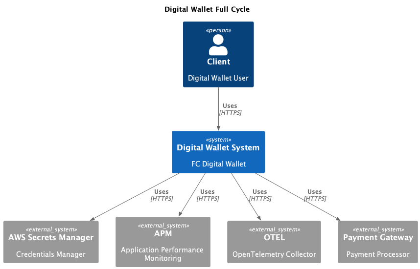

# Curso Full Cycle 3.0 - Módulo Arquitetura baseada em microserviços

    
    

---

## Descrição

O Curso Full Cycle é uma formação completa para fazer com que pessoas desenvolvedoras sejam capazes de trabalhar em projetos expressivos sendo capazes de desenvolver aplicações de grande porte utilizando de boas práticas de desenvolvimento.

---

## Repositório Pai
https://github.com/alcir-junior-caju/study-full-cycle-3-0

---

## Visualizar o projeto na IDE:

Para quem quiser visualizar o projeto na IDE clique no teclado a tecla `ponto`, esse recurso do GitHub é bem bacana

---
### O que são microserviços
- Aplicações comuns;
- Objetivos bem definidos;
- Faz parte de um ecossistema;
- São independentes ou autônomos;
- Se comunicam o tempo todo;

### Diferenças entre sistemas monolíticos e microserviços
|     | Microserviços | Monolíticos |
| --- | ------------- | ----------- |
| **Objetivos / Domínio bem definido** | Objetivos definidos | Todos os contextos dentro da mesma aplicação |
| **Linguagens de programação** | Diversas tecnologias | Única tecnologia |
| **Deploy** | Menos risco | Risco maior de tudo cair |
| **Organizacional das equipes** | Equipes por microcerviços | Todas equipes no mesmo sistema |
| **Começar um projeto / POC** | Muitas indefinições no negócio | Mais simples |

### Quando utilizar?
| --- | Microserviços | Monolíticos |
| --- | ------------- | ----------- |
| **Novos projetos onde não conhecemos todo o domínio** | - | X |
| **POC (Provas de conceito)** | - | X |
| **Governança simplificada sobre tecnologias** | - | X |
| **Facilidade na contratação e treinamento** | - | X |
| **Tudo está no mesmo lugar** | - | X |
| **Compartilhamento claro de libs (Shared kernel)** | - | X |
| **Escalar times** | X | - |
| **Contextos bem definidos / área de negócio** | X | - |
| **Maturidade no processo de entrega** | X | - |
| **Maturidade dos times** | X | - |
| **Necessidade de escala de pontos do sistema** | X | - |
| **Tecnologias específicas em pontos do sistema** | X | - |

### Migração de monolitos para microserviços
- Separação de contextos (DDD);
- Evitar excesso de granularidade;
- Verificar dependências (monolito distribuído);
- Planeje o processo de migração dos bancos de dados;
- Não tenha medo de duplicação de dados;
- Eventos;
- Consistência eventual;
- CI/CD/Testes/Ambientes (Maturidade);
- Comece pelas beiradas;
- Padrão de estrangulamento;

### 9 características spbre microserviços por Martin Folwer:
- Componentização via serviços;
- Organização através das áreas de negócios;
- Smart endpoints and dumb pipes;
- Produtos e não projetos;
- Desenhado para falhar;
- Governança descentralizada;
- Gerenciamento de dados descentralizado;
- Automação de infraestrutura;

### Resiliência:
- Em algum momento todo sistema vai falhar;
- Resiliência é um conjunto de estratégias adotadas intencionalmente para a adaptação de um sistema quando uma falha ocorre;
- Ter estratégias de resiliência nos possibilita minimizar os riscos de perda de dados e transações importantes para o negócio;

### Quais as estratégias?
- Proteger e ser protegido;
    - Um sistema em uma arquitetura distrbuída precisa adotar mecanismos de autopreservação para garantir ao máximo sua operação com qualidade;
    - Um sistema não pode ser egoísta ao ponto de realizar mais requisições em um sistema que está falhando;
    - Um sistema lento no ar muitas vezes é pior do que um sistema fora do ar. (efeito dominó);
- Health check;
    - Sem sinais vitais, não é possível saber a saúde de um sistema;
    - Um sistema que não está saudável possuí uma chance de se recuperar caso o tráfego pare de ser direcionado a ele temporáriamente. (self-healing);
    - Health check de qualidade;
        - Passivo: Alguém verifica a saúde, a partir disso ele sabe como vai se comportar;
        - Ativo: O próprio sistema ou outros sistemas se verifica;
- Rate Limiting;
    - Protege o sistema baseado no que ele foi projetado para suportar;
    - Preferência programada por tipo de client;
- Circuit breaker;
    - Protege o sistema fazendo com que as requisições feitas para ele sejam negadas. Ex.: 500;
    - Circuito Fechado - RequisiçÕes chegam normalmente;
    - Circuito Aberto - Requisições não chegam ao sistema. Erro instantâneo ao client;
    - Meio Aberto - Permite uma quantidade limitada de requisiçÕes para verificação se o sistema tem condições de voltar ao ar integralmente;
- API Gateway;
    - Garante que requisições inapropriadas cheguem até o sistema. Ex.: usuário não autenticado;
    - Implementa políticas de Rate Limiting, Health check, etc;
- Service Mesh;
    - Controla o tráfego de rede;
    - Evitar implementações de proteção pelo próprio sistema;
    - mTLS;
    - Circuit breaker, retry, timeout, fault injection, etc;
- Trabalhar de forma assíncrona;
    - Evita perda de dados;
    - Não há perda de dados no envio de uma transação se o server estiver fora;
    - Servidor poder processar a transação em seu tempo quando estiver online;
    - Entender com profundidade o message broker / sistema de stream;
- Garantias de entrega: Retry;
    - Gráficos no Mind Map;
- Situações complexas;
    - O que acontece se o message broker cair?
    - Haverá perda de mensagens?
    - Seu sistema ficará fora do ar?
    - Como garantir resiliência?
- Transactional outbox;
    - Basicamente salvar essa mensagem antes te enviar para o message broker;
    - Assim que receber a mensagem apagar o registro;
- Garantia de recebimento;
    - Auto Ack - false e commit manual;
    - Prefetch alinhado a volumetria;
- Idempotência e políticas de fallback;
    - Lidar com duplicidades de informações;
    - Poíticas claras de fallback;
- Observabilidade;
    - APM - Application Performance Monitor;
    - Tracing distribuído;
    - Métricas personalizadas;
    - Spans personalizados;
    - Open Telemetry;
- Rerefrências:
    - Exponential backoff and Jitter: https://aws.amazon.com/pt/blogs/architecture/exponential-backoff-and-jitter/
    - Remédio ou Veneno - https://www.youtube.com/watch?v=1MkPpKPyBps
    - OTEL - https://opentelemetry.io/

### Coreografia e Orquestração
- Gráfico no Mind Map;

### Padrões
- API Composition;
    - Service Composer;
    - API Gateway;
- Decompose by business capability;
- Strangler application;
- ACL (Anti Curruption Layer);
- API Gateway;
- BFF (Backend for frontends);
- Transactional Outbox;
- Secret Manager / Vault;
- Padronização de Logs;
- Open Telemetry;
- Service Template;

### C4 Model
- PlantUML Vscode extension;
- https://github.com/plantuml-stdlib/C4-PlantUML;
- https://graphviz.org/download/;
- Java;

#### Context:

#### Container:

### Link Mind Map:
https://whimsical.com/arquitetura-baseada-em-microsservicos-H8QwjyxZmd8hJFzhUpaFwp
